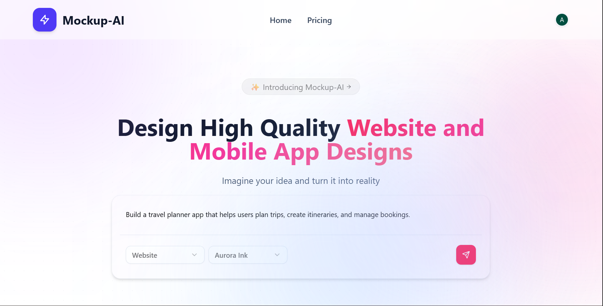

# ✨ Forma: Turn Your Ideas into Stunning UI Designs

Forma is a powerful, AI-driven platform designed to transform your creative concepts into high-fidelity Website and Mobile App mockups in seconds. Whether you're a founder, designer, or developer, Forma helps you bridge the gap between imagination and reality using state-of-the-art Generative AI.



## 🚀 Key Features

- **🤖 AI-Powered Generation**: Simply describe your project, and watch as our AI generates full-page designs with relevant components, themes, and layouts.
- **📱 Multi-Device Support**: Tailor your designs specifically for Web or Mobile platforms.
- **🎨 WCAG-Relative Theme Engine**: Color-harmonized custom theme builder. Automatically derives all 18 CSS token variables (muted, card, border, foreground texts) from user colors using luminance contrast math so themes always look coherent.
- **📥 In-Memory CSS Import**: Upload brand `.css` files directly in-memory to automatically extract CSS variable colors (`--primary`, `--background`, `--card`, etc.) and prefill theme pickers.
- **🔍 Smooth Zooming & Panning Canvas**: Highly responsive canvas navigation utilizing fractional wheel/trackpad scaling steps (`0.08`), trackpad pinch support (`smoothStep`), and velocity-based inertial momentum deceleration.
- **🎬 True Fullscreen Prototype Player**: Interactive HUD presentation player that requests native browser fullscreen API, expands web mockups to full page width (`100vw`), wraps mobile mockups in notched frames, and supports keyboard (arrows & Esc) navigation.
- **⚡ Staggered Skeleton States**: Staggered loading stacks and pulse loading screen configs to prevent blank canvas whiteouts.
- **✍️ Interactive Workspace**: Drag, position, and resize screen frames fluidly on the zoomable canvas.
- **💻 Source Code Inspector & Exporter**: Instantly inspect generated HTML/Tailwind mockup code, adjust display font size size, copy code, or export designs to PNG images.
- **🪄 Direct Screen Regenerator**: Refine specific screens inline by providing conversational feedback text to regenerate code config modifications instantly.
- **🧠 Persisted AI Design Reviews**: Generate AI UX design audits, accessibility reports, and interaction feedback, stored natively in the PostgreSQL database to preserve history and prevent redundant generation costs.
- **🛠️ Detached Screen Toolbars**: Floating workspace controls with enlarged, comfortable click targets and instant tooltips ("Source Code", "Download", "Design Review", "Magic Edit") positioned above screen mockups.
- **📂 Workspace Project Dashboard**: Create, retrieve, and delete mockups, maintaining distinct user workspace histories.

## 🛠️ Tech Stack

- **Frontend**: [Next.js 16](https://nextjs.org/) (App Router), [React 19](https://react.dev/)
- **Styling**: [Tailwind CSS](https://tailwindcss.com/), [Radix UI](https://www.radix-ui.com/), [Lucide React](https://lucide.dev/)
- **Authentication**: [Clerk](https://clerk.com/)
- **Database & ORM**: [Neon DB](https://neon.tech/) (PostgreSQL) + [Drizzle ORM](https://orm.drizzle.team/)
- **AI Engine**: [Google Gemini 2.5 Flash / 3.5 Flash](https://ai.google.dev/)
- **Utilities**: `html2canvas` (Exporting), `react-rnd` (Resizing/Dragging), `react-zoom-pan-pinch` (Canvas Nav)

## 🏗️ Architecture & Code Modularization

The codebase follows a highly modular, decoupled architecture following **SOLID** principles:

```text
┌────────────────────────────────────────────────────────────────────────┐
│                              CLIENT / UI                               │
│  (React 19 Components, Context APIs, Next.js Pages, Clerk Auth Buttons)│
└───────────────────┬────────────────────────────────┬───────────────────┘
                    │ (HTTP Requests)                │ (Client State)
                    ▼                                ▼
┌──────────────────────────────────────┐  ┌──────────────────────────────┐
│       NEXT.JS API ROUTING LAYER      │  │        REACT CONTEXTS        │
│    (app/api/project/route.ts, etc.)  │  │  (SettingContext, Refresher) │
└───────────────────┬──────────────────┘  └──────────────────────────────┘
                    │ (Domain controller calls)
                    ▼
┌────────────────────────────────────────────────────────────────────────┐
│                            CONTROLLER LAYER                            │
│           (ai.controller.ts, project.controller.ts, etc.)              │
└───────────────────┬────────────────────────────────┬───────────────────┘
                    │                                │
                    ▼ (Drizzle SQL Query)            ▼ (Gemini AI Prompt)
┌──────────────────────────────────────┐  ┌──────────────────────────────┐
│           NEON POSTGRESQL            │  │          GEMINI API          │
│        (Database Schema Layer)       │  │    (Generative AI Model)     │
└──────────────────────────────────────┘  └──────────────────────────────┘
```

### 1. Routing Layer (`app/api/`)
Handles HTTP concerns exclusively. Route handlers in the `route.ts` files parse parameters, authenticate Clerk sessions, and return responses. They do **not** run database queries or directly invoke AI logic.

### 2. Controller Layer (`controllers/`)
Encapsulates all database operations, transaction handling, and third-party AI APIs. Divided according to business domains:
- **[user.controller.ts](file:///d:/uiux-mockup-ai/controllers/user.controller.ts)**: Handles user synchronizations.
- **[project.controller.ts](file:///d:/uiux-mockup-ai/controllers/project.controller.ts)**: Handles project creation, retrieval, updates, and deletion.
- **[ai.controller.ts](file:///d:/uiux-mockup-ai/controllers/ai.controller.ts)**: Manages Gemini system instruction setups, config outlines, UI generations, edits, and additional screen appending.

---

## 📂 Project Structure

```text
forma/
├── app/                       # Next.js App Router Structure
│   ├── api/                   # HTTP Request Routing Layer
│   │   ├── edit-screen/
│   │   ├── generate-config/
│   │   ├── project/
│   │   └── user/
│   ├── dashboard/             # Project Explorer Dashboard
│   ├── project/               # Canvas Workspace & Prototype Viewers
│   ├── sign-in/
│   ├── sign-up/
│   ├── layout.tsx             # Global Font & Clerk Providers
│   └── page.tsx               # Homepage / Workspace Creator Landing
├── controllers/               # Business Domain Controllers (SOLID)
│   ├── ai.controller.ts       # AI Generations, Blueprints, & Appends
│   ├── project.controller.ts  # Neon DB Project Transactions
│   └── user.controller.ts     # User Account Profile Mappings
├── components/                # Modular Interface Elements
│   ├── custom/                # Custom Color Theme Builder Panel
│   └── ui/                    # Base Radix-UI/Shadcn Primitives
├── _shared/                   # Global Layout / Composition Components
│   ├── Canvas.tsx             # Pan & Zoom Workspace View
│   ├── Footer.tsx             # Main Landing Footer
│   ├── Header.tsx             # Authentication Navbar Controls
│   ├── Hero.tsx               # Redesigned Search Input & Themes Popover
│   ├── PrototypePlayer.tsx    # Fullscreen Native Mode HUD Presentation Player
│   ├── ScreenFrame.tsx        # Drag/Resize iframe Wrapper
│   └── ScreenSkeleton.tsx     # Staggered Staging Loading States
├── config/                    # Drivers & Client Initializers
│   ├── db.ts                  # Neon Serverless PostgreSQL Instance
│   ├── gemini.ts              # Google GenAI SDK Setup
│   └── schema.ts              # Drizzle ORM Database Schema Definitions
├── context/                   # Context State Containers
│   ├── SettingContext.tsx     # Workspace Sizing state
│   └── RefreshDataContext.tsx # Workspace Refresh state
├── data/                      # Presets & Prompt Templates
│   ├── Theme.ts               # Color-harmony mathematical utility code
│   ├── prompt.ts              # Blueprint & Screen Code System Instructions
│   └── constants.ts           # HTML wrapping templates
├── types/                     # Shared Interfaces & Type Assertions
└── tailwind.config.js         # Base Utility & Custom Font Mappings
```

## ⚙️ Getting Started

### Prerequisites

- Node.js (Latest LTS recommended)
- A Neon PostgreSQL database instance
- A Clerk account for authentication
- API Key for Google Gemini

### Installation

1. **Clone the repository**:
   ```bash
   git clone https://github.com/your-username/forma.git
   cd forma
   ```

2. **Install dependencies**:
   ```bash
   npm install
   ```

3. **Set up environment variables**:
   Create a `.env.local` file in the root directory and add the following:
   ```env
   NEXT_PUBLIC_CLERK_PUBLISHABLE_KEY=your_clerk_pub_key
   CLERK_SECRET_KEY=your_clerk_secret_key
   NEXT_PUBLIC_CLERK_SIGN_IN_URL=/sign-in
   NEXT_PUBLIC_CLERK_SIGN_UP_URL=/sign-up

   DATABASE_URL=your_neon_db_url

   NEXT_PUBLIC_GEMINI_API_KEY=your_gemini_api_key
   ```

4. **Run database migrations**:
   ```bash
   npx drizzle-kit push
   ```

5. **Start the development server**:
   ```bash
   npm run dev
   ```
   Open [http://localhost:3000](http://localhost:3000) with your browser to see the result.

## 📂 Project Structure

- `app/`: Next.js App Router pages and API route handlers.
- `controllers/`: Modular controllers containing core business, database, and AI logic.
- `components/`: Reusable UI components (shadcn/ui and custom).
- `_shared/`: Shared layout components (Header, Hero, Canvas, etc.).
- `config/`: Database connection and Gemini client setup.
- `context/`: Strongly typed React context providers.
- `data/`: Curated themes, prompts, and static constants.
- `types/`: Custom TypeScript type definitions.

---

Built with ❤️ by Agrim Gupta
